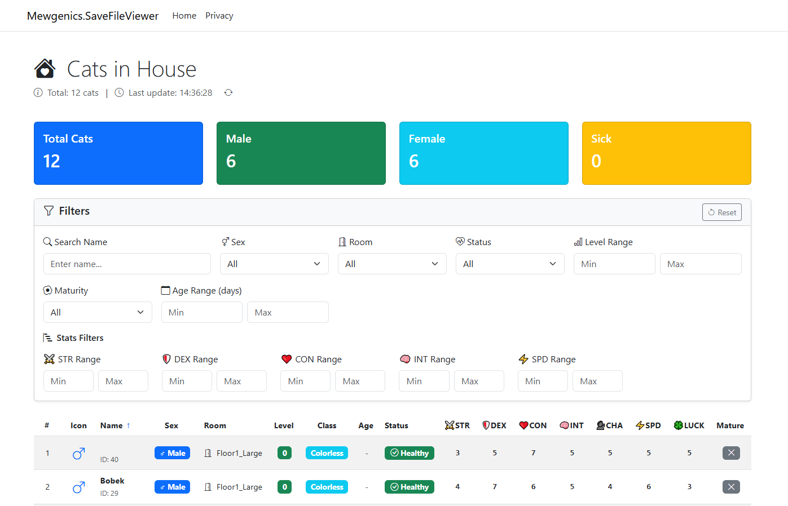

# Mewgenics Cat Viewer


Real-time cat visualization tool for Mewgenics players. This application displays all your cats in real-time, allowing you to filter and sort them by various parameters to find the perfect team for your next run.


## Features

- **Real-time data updates**: Cat data automatically refreshes when the game saves
- **Advanced filtering**: Filter cats by different parameters
- **Sorting capabilities**: Sort cats to find the best candidates
- **Clean web interface**: Accessible through your browser
- **Instant selection**: Quickly compare and choose cats for your next run


## Prerequisites

- [.NET SDK](https://dotnet.microsoft.com/download) (version 8.0 or later)
- Mewgenics save file

## Installation

1. Clone the repository:
```bash
git clone https://github.com/yourusername/mewgenics-cat-viewer.git
cd mewgenics-cat-viewer
```

2. Build the project:
```bash
dotnet build
```

## Usage

Start the application by providing the path to your Mewgenics save file:

```bash
dotnet run -c Release --dbpath "%AppData%\Glaiel Games\Mewgenics\76561197960271872\saves\*.sav"
```

The application will start a web server on port 5147. Open your browser and navigate to:
```bash
http://localhost:5147
```

## How It Works

- **Data updates**: The cat data refreshes automatically whenever the game saves new information
- **Page refresh**: Note that the HTML page itself does not auto-refresh - you'll need to manually refresh your browser to see the updated data
- **Read-only operation**: The application only reads your save file and never modifies it

## Purpose & Origin Story

This tool was created to solve a specific problem in Mewgenics. After completing runs, when needing to sort through newly acquired cats and compare them with existing ones, the process was unnecessarily tedious:

- Constantly clicking on each cat individually through the game interface
- Trying to remember which cat had which parameters for comparison
- Difficulty comparing cats side-by-side due to the game's UI limitations

The solution was to create a table where all cats would be visible in one place, making it easy to compare them against each other at a glance. This eliminates the need for mental note-taking and repetitive clicking through dozens of cats - all the necessary information is available in a single view.

## Technical Details

- Built with C# and ASP.NET Core (.NET 8.0)
- Real-time data updates via file system watching (save file changes only)
- Lightweight web interface for easy access
- Automatic data parsing from Mewgenics save files

## Important Notes

- **READ-ONLY OPERATION**: This application only reads your save file. It never modifies, writes to, or alters your save file in any way. Your game data remains completely safe and untouched.
- **Data updates**: Cat information updates automatically when the save file changes
- **Browser refresh required**: You need to manually refresh the web page to see the latest data

## Contributing

Contributions are welcome! Please feel free to submit a Pull Request.

## License

[MIT License](LICENSE)

## Disclaimer

**IMPORTANT DISCLAIMER**

This project was created with the assistance of AI (neural networks). As such:

- It may contain bugs and suboptimal code
- It has not been thoroughly tested
- Performance may not be optimized
- Edge cases may not be handled properly
- It does exactly what it needs to do and nothing more

This tool comes with no guarantees of any kind. It is provided "as is", without warranty of any kind, express or implied. Use it at your own risk.